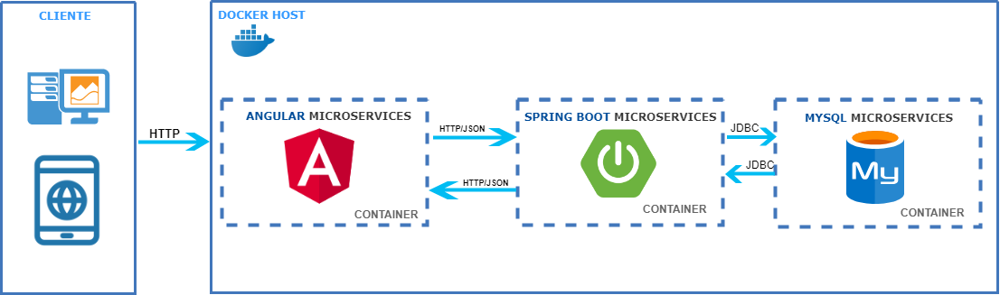

<h1>Projeto de sistema para avalia&ccedil;&atilde;o da empresa Samaia It.</h1>
<h2> Objetivo:</h2>
<h4>Est&aacute; aplica&ccedil;&atilde;o foi desenvolvida com objetivo de ser avaliada pela empresa Samaia It. Tendo como as principais funcionalidade tais como cradastrar, listar, editar e deletar um cadastro.</h4>
<h2>Pr&eacute;-requisitos:</h2>
<ul>
<li>
<h4>Sistema operacional Windows</h4>
</li>
<li>
<h4>Sistema Docker instalado</h4>
</li>
</ul>
<h2><strong>Rodando a aplica&ccedil;&atilde;o:</strong></h2>
<h2>Testando a aplica&ccedil;&atilde;o:</h2>
<h4>Abra um Browser e coloque o seguinte endere&ccedil;o: http://localhost:4200/ conforme imagem 1 abaixo.</h4>
<h4>&nbsp;</h4>
<h2>Principais Tecnologias:</h2>
<ul>
<li>
<h4>Angular 7</h4>
</li>
<li>
<h4>Spring book</h4>
</li>
<li>
<h4>Hibernate/JPA</h4>
</li>
<li>
<h4>Java</h4>
</li>
<li>
<h4>Mysql</h4>
</li> 
</ul>
<h2>Arquitetura:</h2>
<h4>A arquitetura deste projeto &eacute; baseada em microsservi&ccedil;os, utilizando a ferramenta docker para a aplica&ccedil;&atilde;o do conceito. A arquitetura est&aacute; dividida da seguinte formar:</h4>
<h4>No conteiner_1:--&gt; Est&aacute; executando a Tecnologia Angular para o front-end da aplica&ccedil;&atilde;o. No conteiner_2:--&gt;Est&aacute; executando a Tecnologia Spring book para o back-end da aplica&ccedil;&atilde;o. No conteiner_3:--&gt;Est&aacute; executando a ferramenta Mysql para a persist&ecirc;ncia de dados da aplica&ccedil;&atilde;o.
 Segue imagem1 para demostra&ccedil;&atilde;o.</h4>

  Imagem_1
<h2>Depend&ecirc;ncias maven:</h2>
<h4> &lt;//&gt;</h4>
<h2> Vers&atilde;o:</h2>
<h4>1.0.0</h4>
<h2> Autor:</h2>
<h4>Thiago Salvador</h4>

<a href="https://www.linkedin.com/in/thiagocostasalvador/">Saima mais!</a>

<h2>Licen&ccedil;a:</h2>
<h4>O conte&uacute;do desse projeto, em si, &eacute; licenciado sob a licen&ccedil;a <a href="https://opensource.org/licenses/">MIT</a> e propriedade intelectual do autor.</h4>
<h2>Agradecimentos:</h2>
<h4>Agrade&ccedil;o a Deus por te me dado o dom do conhecimento e a minha exist&ecirc;ncia. Agrade&ccedil;o a colabora&ccedil;&atilde;o da minha fam&iacute;lia. Agrade&ccedil;o ao profissional Fabian Silva, por ter me dado a oportunidade de realizar esse projeto para aplica&ccedil;&atilde;o de avalia&ccedil;&atilde;o da empresa SAMAIA It.</h4>
