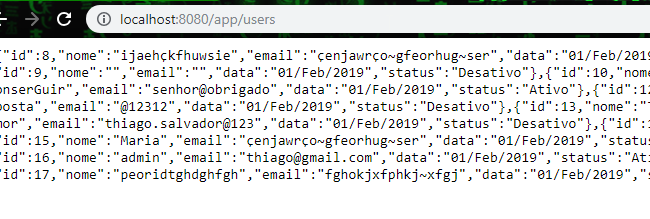
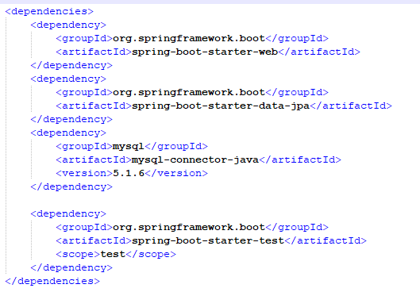

<h1>Projeto de sistema para avalia&ccedil;&atilde;o da empresa Samaia It.</h1>
<h2> Objetivo:</h2>
<h4>Est&aacute; aplica&ccedil;&atilde;o foi desenvolvida com objetivo de ser avaliada pela empresa Samaia It. Tendo como as principais funcionalidade tais como cradastrar, listar, editar e deletar um cadastro.</h4>
<h2>Pr&eacute;-requisitos:</h2>
<ul>
<li>
<h4>Sistema operacional Windows</h4>
</li>
<li>
<h4>Sistema Docker instalado</h4>
</li>
</ul>
<h2><strong>Rodando a aplica&ccedil;&atilde;o:</strong></h2>
<h3>Rodando pelo Docker:</h3>
<h4>1.Faça o clone do projeto</h4>
<h4>2. Execulte no terminal o comando "docker-compose up"</h4>
<h5>Será criado uma imagem do java para rodar o >contato</h5>
<h5>Será criado uma imagem do Node para rodar o >ContatoApp</h5>
<h5>Será criado uma imagem do Mysql para rodar o >A base de Dados Mysql configurada.</h5>

<h3>Rodando pelo Windows</h3>
<h4>1.Faça o clone do projeto</h4>
<h4>2.Entre na pasta "ContatoApp" e execulte o comando pelo CMD npm install, ou importe a pasta para um IDE e habilite o terminal e execulte o mesmo comando anterior</h4>
<h4>3.Importe a pasta "contato" para um IDE que tenha tomcate ou compilador java.</h4>
<h4>4. Acesse a pasta "resources" abra o arquivo "application.properties" substitua o link de url, nome e senha para seu banco de dados</h4>
<h2>Testando a aplica&ccedil;&atilde;o:</h2>
<h3>Testando o Front-end</h3>
<h4>Abra um Browser e coloque o seguinte endere&ccedil;o: http://localhost:4200/ conforme imagem 1 abaixo.</h4>

imagem_1
<h3>Testando o Back-end</h3>
<h4>Abra um Browser e coloque o seguinte endere&ccedil;o: http://localhost:8080/app/users conforme imagem 2 abaixo.</h4>

imagem_2
<h4>&nbsp;</h4>
<h2>Principais Tecnologias:</h2>
<ul>
<li>
<h4>Angular 7</h4>
</li>
<li>
<h4>Spring book</h4>
</li>
<li>
<h4>Hibernate/JPA</h4>
</li>
<li>
<h4>Java</h4>
</li>
<li>
<h4>Mysql</h4>
</li> 
</ul>
<h2>Arquitetura:</h2>
<h4>A arquitetura deste projeto &eacute; baseada em microsservi&ccedil;os, utilizando a ferramenta docker e spring para a aplica&ccedil;&atilde;o do conceito. A arquitetura est&aacute; dividida da seguinte formar:</h4>
<h4>No conteiner_1:--&gt; Est&aacute; executando a Tecnologia Angular para o front-end da aplica&ccedil;&atilde;o. No conteiner_2:--&gt;Est&aacute; executando a Tecnologia Spring book para o back-end da aplica&ccedil;&atilde;o. No conteiner_3:--&gt;Est&aacute; executando a ferramenta Mysql para a persist&ecirc;ncia de dados da aplica&ccedil;&atilde;o.
 Segue imagem 3 para demostra&ccedil;&atilde;o.</h4>

  Imagem_3
<h2>BD de criação</h2>
CREATE TABLE contato ( id INT NOT NULL AUTO_INCREMENT, nome VARCHAR(250), email VARCHAR(250), data DATETIME NULL DEFAULT CURRENT_TIMESTAMP, status TINYINT NULL DEFAULT 1, PRIMARY KEY (id));
<h2>Depend&ecirc;ncias Marvin :</h2>

<h2> Vers&atilde;o:</h2>
<h4>1.0.0</h4>
<h2> Autor:</h2>
<h4>Thiago Salvador</h4>

<a href="https://www.linkedin.com/in/thiagocostasalvador/">Saima mais!</a>

<h2>Licen&ccedil;a:</h2>
<h4>O conte&uacute;do desse projeto, em si, &eacute; licenciado sob a licen&ccedil;a <a href="https://opensource.org/licenses/">MIT</a> e propriedade intelectual do autor.</h4>
<h2>Agradecimentos:</h2>
<h4>Agrade&ccedil;o a Deus por te me dado o dom do conhecimento e a minha exist&ecirc;ncia. Agrade&ccedil;o a colabora&ccedil;&atilde;o da minha fam&iacute;lia. Agrade&ccedil;o ao profissional Fabian Silva, por ter me dado a oportunidade de realizar esse projeto para aplica&ccedil;&atilde;o de avalia&ccedil;&atilde;o da empresa SAMAIA It.</h4>
